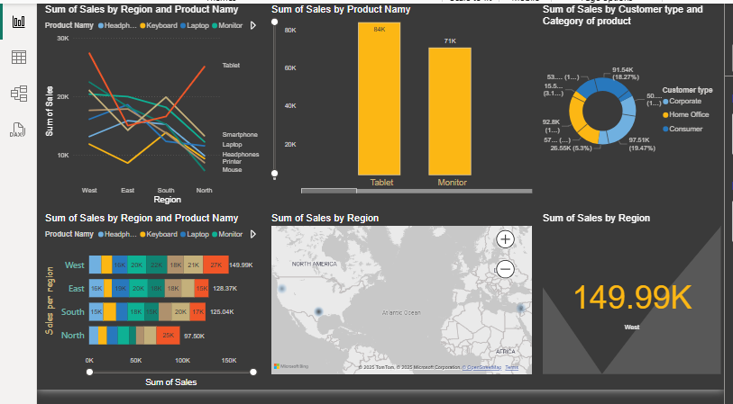

# Retail-Sales-PowerBI-Dashboard
# Retail Sales Performance Dashboard

This Power BI dashboard analyzes sales data from a retail company across regions, categories, and customer segments.

## Tools Used
- Power BI
- DAX
- Excel

## Features
- KPIs for Total Sales, Profit, and Quantity Sold
- Regional performance comparison
- Customer segmentation
- Dynamic slicers for interactivity

## Screenshots

## File
- `Sales Performance Dashboard.pbix`: Full interactive Power BI dashboard

A Power BI dashboard analyzing retail sales performance
